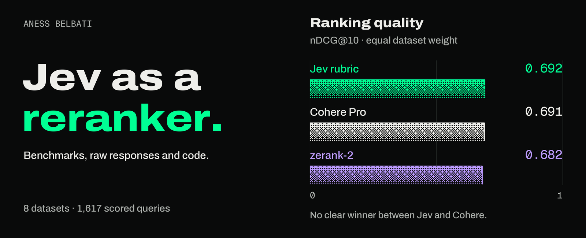

# jev-rerank-bench

I gave [TypeSafe's Jev](https://typesafe.ai/blog/introducing-system-one-models-and-jev) thirty search results and asked
it which ones were useful. Then I gave Cohere and ZeroEntropy the same passages. This repository contains the experiments, saved responses and scoring code.

The ranking average put **Jev's rubric at 0.692 and Cohere Pro at 0.691**, without establishing a winner. Giving
every query equal weight instead puts Cohere ahead. Jev did better on the negation test. An open-source Qwen recipe
improved substantially when I gave it one passage at a time, but still showed no clear gain over keyword ranking.

The main comparison covers eight English datasets. Five more BRIGHT subsets, NevIR negation pairs and MIRACL
French are reported separately. Models start with the same thirty BM25 candidates, cut to 2,000 characters each;
the duel variant only compares the first ten, and NevIR supplies its own two-passage pairs.

Measurements began September 16, 2026; the Qwen controls were added September 17. Jev calls used `jev-latest`,
reporting version 1.13.0. The [evidence viewer](https://anessbelbati.com/lab/jev-reranking/) includes the original
benchmark and the Qwen follow-up, with individual questions, scores and saved outputs.

## Headline (8 English datasets, 1,617 scored questions, each dataset counts once)

| Model | nDCG@10 | Top pick right | Time per query | $ per 1,000 queries | Spots "nothing here" (AUROC) |
|---|---|---|---|---|---|
| Jev 4-level rubric, 30 in one call | 0.692 | 74% | 422 ms | 0.45 | 0.75 |
| Cohere Rerank 4 Pro | 0.691 | 73% | 844 ms | 2.51 | 0.78 |
| Jev 30 yes/no in one call | 0.685 | 72% | 396 ms | 0.41 | 0.75 |
| Jev one Choice + none | 0.684 | 76% | 338 ms | 0.33 | 0.72 |
| Cohere Rerank 4 Fast | 0.684 | 72% | 726 ms | 2.01 | 0.75 |
| ZeroEntropy zerank-2 | 0.682 | 72% | 1.8 s | 0.22 | 0.74 |
| DeepSeek V4.1 Flash JSON, 30 in one call | 0.682 | 73% | 2.2 s | 1.13 | 0.75 |
| Jev cascade (batch prune, then 8 pairs) | 0.674 | 69% | 2.5 s | 0.63 | 0.73 |
| Jev yes/no per pair | 0.670 | 70% | 8.2 s | 0.81 | 0.73 |
| Jev tournament (6 groups, then final) | 0.668 | 75% | 641 ms | 0.43 | 0.71 |
| DeepSeek V4.1 Flash P(yes) per pair | 0.608 | 62% | 34.3 s | 1.38 | 0.65 |
| Jev 45 duels in one call (top 10) | 0.580 | 66% | 324 ms | 0.21 | 0.65 |
| Qwen2.5-1.5B RLCD, one passage per prompt (self-hosted) | 0.471 | 40% | 748 ms | 0.20 | 0.57 |
| Qwen2.5-1.5B RLCD, 30 rubric keys (self-hosted) | 0.340 | 30% | 419 ms | 0.09 | 0.55 |
| Qwen2.5-1.5B RLCD, 30 yes/no keys (self-hosted) | 0.255 | 22% | 360 ms | 0.08 | 0.52 |
| BM25 (floor) | 0.486 | 45% | – | 0 | 0.58 |

- Ranking quality: Jev rubric minus Cohere Pro is +0.001, with a 95% interval of −0.009 to +0.012. This establishes
  neither a winner nor equivalence. With equal weight per query, Cohere scores **0.756** and Jev **0.738**.
- Top-ranked passage: Jev Choice leads Cohere Pro by 3.1 percentage points (95% interval +0.7 to +5.6). This metric
  ignores the separate `none` option; it is not the accuracy of the answer Jev actually selected.
- Negation (NevIR, 1,383 pairs): Jev rubric 71% of pairs right, Cohere Pro 67% (gap +4.2, range +1.5 to +6.9),
  ZeroEntropy 61%; the chat-model baseline 17–22%, below the 25% of guessing.
- Reasoning (7 BRIGHT subsets, 307 questions): Jev rubric averages 0.493 and DeepSeek JSON 0.487; their difference
  remains unresolved. These subjects are a separate comparison, not added to the eight-dataset headline.
- Qwen's one-passage control reaches 0.471, up from 0.255 with thirty yes/no fields. BM25 scores 0.486; the
  Qwen-minus-BM25 interval crosses zero. Details and attribution are below.
- Dataset differences: Cohere Pro leads Jev's yes/no batch by 5.0 points on FiQA, its rubric by 3.9 on Natural
  Questions, and its Choice setup by 6.4 on French. zerank-2 leads the rubric by 2.1 points on TREC-COVID.

The intervals are exploratory paired bootstraps, without adjustment for the multiple comparisons. NevIR kept
passage order fixed and reuses source passages across some pairs. Its 25% chance rate assumes independent random
choices for the two questions.

Table latency is the mean of dataset medians, not a pooled median. API calls include network and serving time;
Qwen timings are model calls on rented GPUs. Costs average the eight dataset rates over all 2,327 original queries,
including queries without relevant candidates. API costs use saved usage and recorded rates; Qwen costs cover
measured GPU time, excluding setup and idle time. These are not invoice-verified or equivalent deployment costs.

Full tables, per-dataset numbers, latency percentiles, usage totals and every check: `results/summary.md`,
`results/*.json`, and the charts in `results/`.

## The Qwen follow-up

[Harsha Gundala's original recipe](https://huggingface.co/harshatheg/Qwen-2.5-1B-RLCD) uses MLX on Apple Silicon.
I tested [Shreyansh Singh's Transformers/PyTorch port](https://huggingface.co/shreyansh26/Qwen-2.5-1B-RLCD) on rented
RTX 4090s. The base model is [Qwen2.5-1.5B-Instruct](https://huggingface.co/Qwen/Qwen2.5-1.5B-Instruct), from Alibaba's
Qwen team. Despite “1B” in the recipe's name, it is a 1.5-billion-parameter model. The port adds serving code and
presets, with no additional fine-tuning; it does not reproduce Jev's training or establish that their architectures match.

The tested `run_parallel_generation` processes the shared prompt once, then reuses its internal cache to evaluate
the fields in a batch. It scores the permitted labels and assembles JSON in code. Prefill and field evaluation
are separate model forwards, and some labels need continuation scoring. I did not test the port's separate tree
mode. Allowed types and normalized label scores do not guarantee correct judgments or calibrated confidence.

With thirty passages together, Qwen scored 0.255 using yes/no fields and 0.340 using the rubric, both below BM25's
0.486. Jev's rubric led Qwen's rubric by 35.2 points (95% interval +33.2 to +37.4). Giving Qwen one passage per prompt
raised it to **0.471**: +21.6 points over its thirty-passage yes/no setup, but no demonstrated improvement over BM25
(difference −0.015; 95% interval −0.033 to +0.004). NevIR paired accuracy was 7% for the batch yes/no configuration, 19% for
the rubric and 34% for the one-passage configuration.

Reversing the thirty passages changed Qwen's top-ranked passage on **1,498 of 1,617 queries (92.6%)**, compared with
**400 (24.7%)** for Jev Choice. As above, these are passage rankings, excluding Jev's `none` option. No repeated
identical Qwen requests were run. This measures order sensitivity, not repeatability or proof that position alone
determines the answer. The one-passage control also changes context length and prompt structure; it does not
isolate parallel decoding as the cause of the quality difference.

`rlcd_check.py` provides the score diagnostics: the relevant-minus-irrelevant yes/no score gap was 0.046 for Qwen
and 0.430 for Jev with the same wording; Qwen's mean score was 0.195 at slot 1 and 0.384 at slot 30. Under reversal,
mean absolute score changes were 0.160 for Qwen and 0.013 for Jev Choice. Those last two values use different score
scales—independent yes/no scores versus a distribution across choices—so they are not a relative stability measure.

This tests the port's ranking quality. It does not reproduce the original quantized Mac demo or test its advertised
JSON-generation speedup.

## What is measured

- **Ranking:** nDCG@10, Top-1, Recall@5 and MRR@10 over questions whose BM25 top-30 holds at least one labelled
  relevant passage. nDCG@10 rewards useful passages near the top; 0.69 does not mean 69% of questions answered
  correctly. It uses linear relevance gains and all supplied relevance labels for the ideal ranking. Ties keep
  BM25 order; the report also breaks ties against each model as a sensitivity check.
- **Latency:** client-observed API timings at the stated concurrency, plus Qwen model-call timings on rented GPUs.
  `network.py` records connection and server-header diagnostics; it does not isolate equivalent model-only times
  across providers. Cohere used OpenRouter, and ZeroEntropy served many calls in its slower fallback mode.
- **Cost:** saved usage multiplied by the recorded rates, or OpenRouter's returned `usage.cost`. These fields were
  not checked against invoices. The Qwen estimate covers measured GPU time only.
- **The "nothing relevant" test:** for every question, a twin list with every relevant passage removed and refilled
  from further down BM25. AUROC of the top score, and the false-accept rate at 90% recall. For Jev also its built-in
  `none` option and its "does any passage answer it?" question.
- **Calibration:** ECE and reliability curves for probability-like scores. Normalizing scores does not establish
  that their confidence values match observed error rates.
- **Uncertainty:** `significance.py` uses 10,000 paired bootstrap resamples of queries within each dataset, then
  averages across the fixed dataset set. An interval crossing zero is inconclusive, not evidence of equivalence.
- **Jev under the microscope:** TypeSafe's confidence bands against real answers, order sensitivity (same 30 passages
  reversed), repeated requests and cold start after 1–15 minutes idle. These repeat tests were on Jev, not Qwen.
- **Shared text:** `batching.py` records one request per batch size with the same thirty SciFact passages. Each
  query adds two typed questions and roughly 443 input tokens. Forty queries cost 2.7 times one query in those
  observations. Only the first query's choice was tracked; complete batched answers were not retained. This does
  not demonstrate quality across all forty answers or equivalent-quality savings over separate requests.
- **Negation:** `nevir_eval.py` scores NevIR by paired accuracy: both questions must rank their correct passage
  strictly higher; ties fail. Fixed passage order, repeated source passages and unadjusted comparisons limit inference.

## Datasets

| Dataset | Domain | Source | Queries | Corpus | Scored* |
|---|---|---|---|---|---|
| SciFact | scientific claims | BEIR, test | 300 | 5,183 abstracts | 264 |
| FiQA-2018 | finance questions | BEIR, test | 648 | 57,638 passages | 411 |
| Natural Questions | real Google searches → Wikipedia | BEIR, test, 500 sampled (seed 0) | 500 | 2,681,468 passages | 320 |
| NFCorpus | medical / nutrition | BEIR, test | 323 | 3,633 documents | 239 |
| TREC-COVID | COVID-19 literature | BEIR, test | 50 | 171,332 papers | 50 |
| BRIGHT biology / economics | reasoning-intensive StackExchange | MTEB `BrightRetrieval` | 103 / 103 | 57,359 / 50,220 | 39 / 38 |
| CodeSearchNet Python | docstring → function | MTEB `CodeSearchNetRetrieval`, 300 sampled | 300 | 1,000 functions | 256 |
| BRIGHT earth science / psychology / robotics / StackOverflow / sustainable living | run after the headline was fixed; reported as their own block | MTEB `BrightRetrieval` | 116 / 101 / 101 / 117 / 108 | 50–60k each | 57 / 29 / 35 / 62 / 47 |
| NevIR | negation pairs, two questions each; paired accuracy, never in the averages | `orionweller/NevIR`, test | 2,766 (1,383 pairs) | 2 per question | 2,766 |
| MIRACL French | French Wikipedia questions (side test) | MTEB `MIRACLReranking` fr/dev | 269 | 100-passage pool per query | 152 |

\* questions whose BM25 top-30 holds at least one relevant passage.

**Candidates.** BM25 (`bm25s`, Snowball stemmer, language stopwords) top 30 per question over the whole corpus (for
MIRACL, over the 100-passage pool MTEB ships per query). Models share the candidate lists and 2,000-character
truncation; the duel's top-ten restriction and NevIR's two-passage pairs are listed separately. These are results
for this candidate-generation pipeline, not official full-benchmark scores. Truncation can remove relevant text,
and the source relevance labels may be incomplete.

## Models and how each is asked

| key | model | how |
|---|---|---|
| `bm25` | BM25 order | the floor; no API |
| `cohere-pro` / `cohere-fast` | Cohere `rerank-4-pro` / `rerank-4-fast` via OpenRouter's rerank endpoint (returned usage cost per call) | one call per query, 30 documents |
| `zerank-2` | ZeroEntropy `zerank-2` | one `POST /v1/models/rerank` per query, 30 documents |
| `deepseek-pair` | DeepSeek V4.1 Flash via OpenRouter, pinned to DeepSeek's own API, thinking off | one call per (query, passage); temperature 0, `max_tokens` 2, `top_logprobs` 10; score = P(yes) / (P(yes) + P(no)) over the first token |
| `deepseek-json` | same model | one call per query: all 30 passages, JSON with a 0–100 score per passage |
| `jev-noul-pair` | `jev-latest` | one call per (query, passage), one yes/no question; score = the probability (TypeSafe's reranking cookbook) |
| `jev-noul-batch` | `jev-latest` | one call per query: 30 passages in the state, 30 yes/no questions (their fan-out pattern) |
| `jev-choice` | `jev-latest` | one call per query: one Choice over the 30 passage ids plus `none`, and a yes/no "does any passage answer it?" (their semantic-search cookbook) |
| `jev-score-batch` | `jev-latest` | one call per query: 30 Score questions with a four-level rubric (off-topic / related / partly / fully); rank by the expected level |
| `jev-duel` | `jev-latest` | one call per query: BM25's top 10 in the state, all 45 pairwise Choices; rank by expected wins; 11–30 keep BM25 order |
| `jev-tournament` | `jev-latest` | two calls: six Choices over groups of five (+none), then a final Choice among the winners (+none) |
| `jev-cascade` | `jev-latest` | one batched yes/no call prunes 30 to 8, then per-pair yes/no on the 8 |
| `jev-choice-reversed` | `jev-latest` | `jev-choice` with the passages sent in reverse order (position-bias check only) |
| `qwen-rlcd-batch` / `qwen-rlcd-rubric` | Qwen2.5-1.5B-Instruct; Shreyansh Singh's Transformers port of Harsha Gundala's constrained-decoding recipe, self-hosted on RTX 4090s | shared-prompt prefill followed by batched field evaluations using `run_parallel_generation`; boolean score = P(true), rubric score = expected level / 3. Some long code-heavy BRIGHT prompts used six fields at a time after GPU memory failures, recorded in the raw rows; see `rlcd_runner.py` |
| `qwen-rlcd-pair` | same model and code | one passage per prompt and one boolean key with the same relevance wording; thirty sequential prompts per query using the same inference function; score = P(true), query latency includes all thirty |
| `qwen-rlcd-batch-reversed` | same | `qwen-rlcd-batch` with the 30 passages in reverse order (order-sensitivity check, the twin of `jev-choice-reversed`); never in the rankings |

The yes/no variants of Jev, DeepSeek and Qwen get the same wording: *"Does the passage contain the information needed to answer or verify the
query?"* (`rerankers/__init__.py`). Cohere and ZeroEntropy take the query and the documents.

## Fairness rules

- Same candidate lists and truncation, with the duel and NevIR exceptions documented above; shared wording for the yes/no variants.
- Ties keep BM25 order for every model; `eval.py` also reports `ndcg10_ties_against`, `tied_top_share`, `zero_score_share`.
- The 8-dataset headline was fixed before the BRIGHT block and NevIR ran; they are reported separately, not averaged in.
- Public datasets may be in any model's training data. Stated, not fixable.
- API clients ran from Algeria; providers and routing paths differed. Qwen ran on rented GPUs.
- Ranking responses are in `cache/`, one JSONL line per query, gzipped. Additional diagnostics save the fields listed in their scripts.

## Reproduce

```
uv sync
cp .env.example .env            # JEV_API_KEY, OPENROUTER_API_KEY, ZEROENTROPY_API_KEY
uv run candidates/build.py      # downloads the datasets, builds BM25 top-30 and the "absent" twins
uv run candidates/build_nevir.py
uv run run.py --model jev-score-batch --dataset all --workers 16
uv run run.py --model cohere-pro --dataset all --workers 12
uv run run.py --model zerank-2 --dataset all --workers 6
uv run eval.py                  # results/summary.md, results/summary.json, charts
uv run significance.py          # bootstrap ranges for every gap
uv run nevir_eval.py            # negation, paired accuracy
uv run rlcd_check.py            # signal and position drift of the Qwen RLCD scores
uv run network.py; uv run batching.py; uv run determinism.py; uv run coldstart.py 60 120 300 600 900
```

Runs resume: a query already in `cache/` (plain or `.gz`) is skipped, and a failed row is redone on the next run.
`--limit N` runs N uncached queries as a smoke test. To re-score saved results without model calls, run only
`eval.py`, `significance.py`, `nevir_eval.py` and `rlcd_check.py`. The `run.py`, network, batching, determinism and
cold-start commands above make new paid requests. Recorded API usage was about $61; that excludes GPU rental costs
and has not been reconciled against invoices.

## Layout

```
data/loaders.py        dataset download + one common shape
candidates/build.py    BM25 top-30 per query plus the "absent" twin  ->  candidates/<dataset>.jsonl (ids, queries, BM25 scores)
candidates/build_nevir.py
rerankers/             jev.py  cohere.py  zerank.py  llm_logprob.py  bm25.py
run.py                 one model on one dataset, both variants, caching every raw response
cache/<model>/         <dataset>.<variant>.jsonl.gz  saved ranking responses, scores, latency, usage, cost
eval.py                metrics, nothing-relevant test, calibration, charts  ->  results/
significance.py  nevir_eval.py  rlcd_check.py  network.py  batching.py  determinism.py  coldstart.py
rlcd_runner.py         the self-hosted Qwen RLCD recipe, run on a GPU pod, writing the same cache rows
blog.py                renders an earlier experiment write-up from results/*.json
scripts/readme_header.py  draws the README header from saved scores and the website fonts
```

The full `candidates/*.docs.jsonl` passage files are not committed; `build.py` regenerates them from the datasets.
Saved model responses may quote source text, and the evidence exporter includes candidate snippets with attribution.

## Public evidence viewer

The interactive evidence viewer lives in the personal website repository and
is available at [anessbelbati.com/lab/jev-reranking/](https://anessbelbati.com/lab/jev-reranking/).
This benchmark repository contains the experiments, saved results, and the data
exporter; it does not contain a separate website app.
The viewer includes the Qwen batched yes/no, four-level rubric, one-passage and reversed-order runs.
The reversed-order run is an order-sensitivity diagnostic over the original eight datasets. Missing runs
remain marked as missing, including Qwen on MIRACL French. Qwen costs are GPU rental estimates and
its timings are measured on the GPU host; neither includes client network time or pod setup.
The source responses are also available in this repository's `cache/qwen-rlcd-*` directories.

With the local candidate passage files available, export the curated snapshot:

```powershell
uv run scripts/export_evidence.py
# Or write directly to a website checkout:
uv run scripts/export_evidence.py --output <website>/public/lab/jev-reranking/data
uv run -m unittest scripts/test_export_evidence.py
```

The default output is `exports/evidence/` (Git-ignored). The export contains
allowlisted saved outputs, the candidate snippets used in the run, prompt
templates, attribution, source hashes, and downloadable dataset archives.
Regeneration reads local records and makes no paid model calls.

## Prices used

| API | price | where it is stated | read |
|---|---|---|---|
| Jev | $0.042 per million input tokens, output free | typesafe.ai launch post | 2026-09-16 |
| Cohere Rerank 4 Pro | $2.50 per 1,000 searches (1 query + up to 100 docs); reported `usage.cost` per call from OpenRouter | OpenRouter response | 2026-09-16 |
| Cohere Rerank 4 Fast | $2.00 per 1,000 searches, same route | OpenRouter response | 2026-09-16 |
| ZeroEntropy zerank-2 | $0.025 per million tokens | zeroentropy.dev/pricing | 2026-09-16 |
| DeepSeek V4.1 Flash | $0.15 / $0.60 per million in / out; reported `usage.cost` per call from OpenRouter | OpenRouter response | 2026-09-16 |
| Qwen2.5-1.5B RLCD (self-hosted) | GPU seconds of each call × $0.74 per hour (RunPod secure-cloud RTX 4090 list price); pod setup time not included | runpod.io pricing | 2026-09-16 |

Usage totals per run (tokens, search units) are in `results/summary.md` so the cost can be checked against the vendor
dashboards.

## License

Code: MIT. Dataset content keeps its source licences (BEIR, MTEB/BRIGHT, CodeSearchNet, NevIR and MIRACL), including
text quoted in saved responses or included in evidence exports. The exporter records source attribution; the code
licence does not replace dataset licences.
